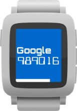
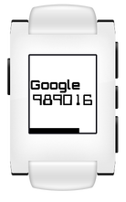
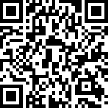

QuickAuth
==========

Google Authenticator for the Pebble smart watch!

   

The app can store up to 16 keys.  You must use 20 or less characters for the label although not all fonts can display 20 characters on the tiny Pebble screen.  It's been tested with 128 character keys which should cover all uses!  When adding any keys, known incorrect characters are corrected and spaces are removed.  Once the keys have been uploaded they'll be saved on the watch and will only be removed during an upgrade.  But don't worry the keys are also stored in the Pebble phone app and reloaded in the event of an upgrade or factory reset of the watch.

The authentication codes are based on time and timezones are also automatically handled.  (In case of time zone errors, just reboot your phone and watch.)

There's a [great guide by Adam Zeis](http://www.connectedly.com/how-get-your-two-step-verification-codes-your-pebble) that explains how to setup the app to work with your Google account.

Happy two-factoring!

### GET IT HERE

